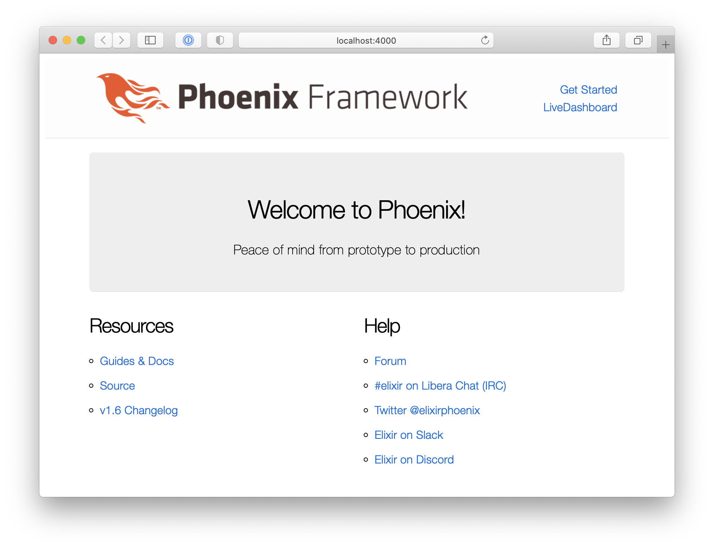
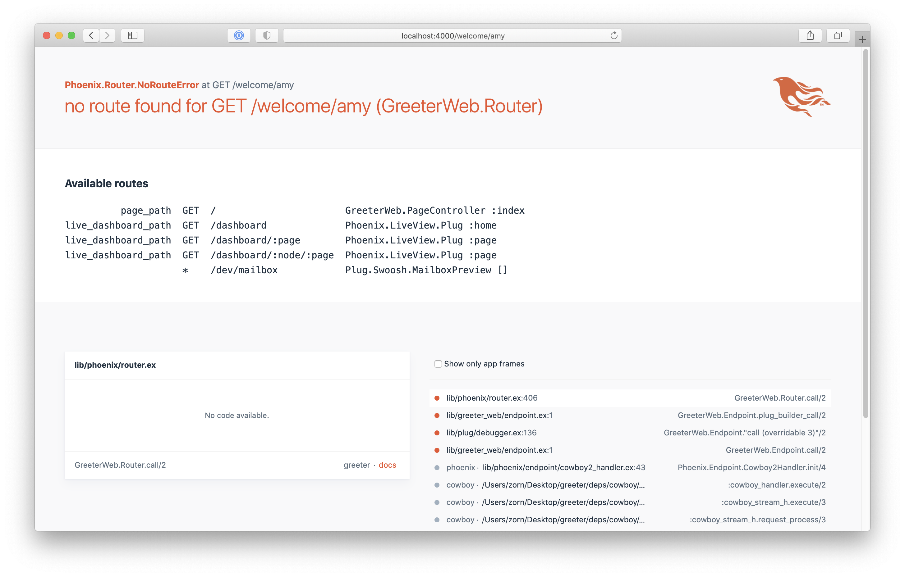

# Greeter

Greeter is a "hello world" example app to help introduce the core concepts of the [Phoenix Framework](https://www.phoenixframework.org/) written in [Elixir](https://elixir-lang.org/).

Built using Elixir 1.11.1 and Phoenix 1.5.6.

This tutorial assumes no previous Elixir experience. In fact the first section will help you install and setup Elixir and Phoenix.

By the end of this example, you'll have created a Phoenix app that can display a custom greeting message with a formatted name.


## Example Notes

Since this is a hello world style app we'll quickly review some Elixir/Phoenix install and setup basics.

### Install Elixir

Installing Elixir on macOS using [Homebrew](https://brew.sh/) can be easy as:

    $ brew install elixir

See the Elixir website for more [installation options](https://elixir-lang.org/install.html).

You can check your currently installed version of Elixir with: 

    $ elixir -v
    Erlang/OTP 23 [erts-11.1.1] [source] [64-bit] [smp:8:8] [ds:8:8:10] [async-threads:1] [hipe] [dtrace]

    Elixir 1.11.1 (compiled with Erlang/OTP 23)

To get Phoenix running we'll need a few more things. The following is a terse list of a typical installation. For a more detailed walkthrough, see the official [Phoenix Installation](https://hexdocs.pm/phoenix/installation.html) guide. 

### Install Mix and Hex

To create and manage new Elixir projects you'll use a command line tool called `mix`. Mix is a build tool that ships with Elixir and provides tasks for creating, compiling, and testing your application. 

Mix itself works closely with the Hex package manager as a source for your project dependencies. You can install or verify that hex is setup with:

    $ mix local.hex

### Install Node.js

Being a web application, your Phoenix app will need to publish assets including CSS and JavaScript files. To help deploy these assets, Phoenix will lean on Node.js tooling. You'll need to make sure `node` is available. Like before, on macOS using Homebrew this could be as simple as:

    $ brew install node

Test availability with:

    $ npm -v
    6.14.8
    $ node --version
    v14.4.0

For more Node.js installation options, see [their website](https://nodejs.org/en/download/).

### No PostgreSQL Install

Many of the Elixir Phoenix apps you'll encounter utilize [PostgreSQL](https://www.postgresql.org/) for storage and so *eventually* you'll want to have it installed. However, to keep things simple, this example will avoid database use and no PostgreSQL installation is necessary.

### Generating the Project

You are now ready to install the Phoenix application generator:

    $ mix archive.install hex phx_new 1.5.6

Since we are not going to use any database storage we will include a flag to skip that dependency in the generated project. For more Phoenix project generator flag options see [the docs](https://hexdocs.pm/phoenix/Mix.Tasks.Phx.New.html).

    $ mix phx.new greeter --no-ecto

When asked if you would like to install dependencies, answer `Yes`.

Change your path into the newly created project directory and start the local development server:

    $ cd greeter
    $ mix phx.server

Visit <http://localhost:4000> and you should see the default Phoenix app page.



### Add a new welcome route.

The goal of this project is to add a new welcome page and have that page display a customized greeting message. If you edit the URL of your browser to <http://localhost:4000/welcome/amy> you'll notice the following 404 experience:



This error page is basically Phoenix saying it does not know how to answer that URL request. It tries to be helpful and displays the requests (aka the routes) that it does know about, and as expected our `welcome` URL is not one of them. 

> This kind of helpful error page is only something that will be shown in local development. It's the result of `debug_errors` being set to `true` inside of `config/dev.exs`. If you toggle that value to `false` and restart the server you can see the much more tame default production experience for 404.

To add a new route you'll want to edit the `routes.ex` file located at: `lib/greeter_web/routes.ex`. Open the routes file and add a new `welcome` route.

#### Listing 1: Adding a new welcome route that also captures a name. (`router.ex`)

```diff
  scope "/", GreeterWeb do
    pipe_through :browser

    get "/", PageController, :index

+   get "/welcome/:name", WelcomeController, :index
  end
```

This new route description tells Phoenix that when an HTTP GET request comes in that starts with `/welcome/` run the code inside the `WelcomeController` using the  `index` function. Also, whatever content was in the URL after the last backslash is put into a parameter called `name`.

To get our new page working we'll need to add a few files: a controller called `WelcomeController`, a view called `WelcomeView` and a template for the `index` action that defines the HTML we'll send back to the browser.

Create the three files using the code listings below.

### Listing 2: Create a `WelcomeController`. (`welcome_controller.ex`)

```elixir
# lib/greeter_web/controllers/welcome_controller.ex
defmodule GreeterWeb.WelcomeController do
  use GreeterWeb, :controller

  def index(conn, _params) do
    render(conn, "index.html")
  end
end
```

### Listing 3: Create a `WelcomeView`. (`welcome_view.ex`)

```elixir
# lib/greeter_web/views/welcome_view.ex
defmodule GreeterWeb.WelcomeView do
  use GreeterWeb, :view
end
```

### Listing 4: Create an `index` page template. (`index.html.eex`)

```html
<!-- lib/greeter_web/templates/welcome/index.html.eex -->
<h1>Welcome!</h1>
```

The Phoenix app should detect the changes to the router and the other new files, but if you run into trouble stop the server and the restart it with `mix phx.server`.

Now, when you load <http://localhost:4000/welcome/amy> you should see the new page with a welcome header. The header still lacks our name, but progress!


You may have noticed the `_params` in that index function. This second argument of the `index` function is what would normally hold the parameters of the request but since those values were not used in our first iteration we prefixed it with an underscore as a way of telling Elixir we are not using this right now. We could have also used an underscore by itself, but prefixing a more meaningful term can usually help code readability and later editing.

Now that we do want to use the params remove the underscore. The type of `params` is actually an [Elixir Map](https://hexdocs.pm/elixir/Map.html) and so we can use some bracket syntax to get at the name value within. Bind a local variable `name` to the name in the params map. Then update the `render` call such that we are passing the name value.

### Listing 5: Get the name value our of params. (`welcome_controller.ex`)


```diff
- def index(conn, _params) do
-    render(conn, "index.html")
+ def index(conn, params) do
+   name = params["name"]
+   render(conn, "index.html", name: name)
  end
```

Now that render is being told what the `name` is we can update the template to display it. Update the welcome header to include the name:

### Listing 6: Add `name` to the template. (`index.html.eex`)

```diff
- <h1>Welcome!</h1>
+ <h1>Welcome, <%= @name %>!</h1>
```

This `<% ... %>` syntax is called [Embedded Elixir](https://hexdocs.pm/eex/EEx.html) and is what we use to make templates dynamic in Phoenix.

Try loading the test url again: <http://localhost:4000/welcome/amy>

Now it's starting to come together!


> #### A quick note about pattern matching.
> 
> There is a very common code style you'll see in everyday Elixir/Phoenix code where the `index` function would have looked like:
> ```elixir
> def index(conn, %{"name" => name}) do
>   render(conn, "index.html", name: name)
> end
> ```
>
> This style uses [Pattern Matching](https://elixir-lang.org/getting-started/pattern-matching.html). Pattern Matching is a core Elixir pattern and is beyond the scope of this hello world example but something you'll want to get more familar with as you get more comfortable with Elixir.

There are two other concepts we want to explore before finishing up. First is overall code structure and organization and the second is some basic testing.

### Adding Business Domain Code

The generated Phoenix project has a specific directory structure to help you organize your code and make things work cleanly with some sane defaults. So far we've been working in `greeter_web` directory but in a larger app you'll have also have lots of business domain code. A good place for that is the `greeter` directory right next to `greeter_web`. Since this app is pretty basic we'll keep the business domain stuff pretty simple. We'll create a formatter module to make names look nicer. It's not much but it will help demo how code can be separated.

Create a new `NameFormatter` module with a simple `format` function that will capitalize our names.

### Listing 7: Create a `NameFormatter` module. (`name_formatter.ex`)

```elixir
# lib/greeter/name_formatter.ex
defmodule Greeter.NameFormatter do
  def format(name) do
    String.capitalize(name)
  end
end
```

Before we get to integrating this new formatter, let's add some tests to verify our expectations. One of the `mix` tasks is to run all of our project's tests, and the default Phoenix project generator made a few for you. 

    $ mix test
    .....
    
    Finished in 0.1 seconds
    5 tests, 0 failures

Let's add a new test file for our `NameFormatter`. Generally it is a good idea to mirror each major type in the app with a similarly named test file. Under the `test` directory at the root of your project, find the `greeter` directory and then make a test file for the `NameFormatter` module: 

### Listing 8: Create a `NameFormatterTest` file. (`name_formatter_test.exs`)

```elixir
# test/greeter/name_formatter_test.exs
defmodule Greeter.NameFormatterTest do
  use ExUnit.Case, async: true

  describe "format/1" do
    test "works with simple name" do
      assert Greeter.NameFormatter.format("mike") == "Mike"
    end
  end
end
```

> Note: The test file ends in `.exs` while many of the previous code files you made ended in `.ex`. 
> 
> `.ex` is used for compiled code, `.exs` is for interpreted code and is better suited to things like tests or simple scripts.

Now re-run `mix test` to verify the tests work. 

    $ mix test

Put the test in a failing string to see how it fails too. 

If you want to run just this test file use:

    $ mix test test/greeter/name_formatter_test.exs

Testing using [ExUnit](https://hexdocs.pm/ex_unit/ExUnit.html) is a deeper topic than we can cover in a hello world example, but just knowing it is well integrated into the tooling is good to know.

Now that we have a working formatter, let's update our controller to use it:

### Listing 9: Update `index` to use our new name formatter. (`welcome_controller.ex`)

```diff
  def index(conn, params) do
    name = params["name"]
-   render(conn, "index.html", name: name)
+   formatted_name = Greeter.NameFormatter.format(name)
+   render(conn, "index.html", name: formatted_name)
  end
```

And add a test to verify the new controller behavior:

### Listing 10: Create a `WelcomeControllerTest` file. (`welcome_controller_test.exs`)

```elixir
# test/greeter_web/controllers/welcome_controller_test.exs
defmodule GreeterWeb.WelcomeControllerTest do
  use GreeterWeb.ConnCase

  test "GET /welcome/gus", %{conn: conn} do
    conn = get(conn, "/welcome/gus")
    assert html_response(conn, 200) =~ "Welcome, Gus!"
  end
end
```
You can verify the new behavior by rerunning the tests:

    $ mix test

Or rebooting the local dev server:

    $ mix phx.server


### Conclusion

Hello world is a classic milestone for anyone learning a new technology or programming language. Congrats on your first steps into Elixir and Phoenix!

You've accomplished a lot of great things today, including:

* Installing Elixir and Phoenix.
* Generating a new Phoenix project.
* Adding a custom route, controller and template.
* Building out some simple business domain behavior.
* Verifying your work through tests!

For more helpful resources learning Elixir check out the language website:

<https://elixir-lang.org/learning.html>

For more helpful resources learning Phoenix check out the links here:

<https://hexdocs.pm/phoenix/community.html>

If you have any feedback on this tutorial or want to see more, please reach out to: <mike@mikezornek.com>.

Thanks for your interest and best of luck learning Phoenix!